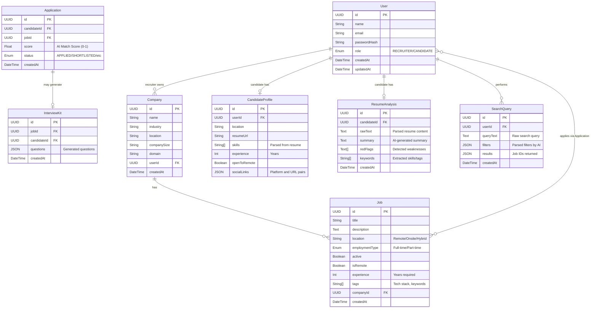

```mermaid
erDiagram
User {
UUID id PK
String name
String email
String passwordHash
Enum role "RECRUITER/CANDIDATE"
DateTime createdAt
DateTime updatedAt
}

    Company {
        UUID id PK
        String name
        String industry
        String location
        String companySize
        String domain
        UUID userId FK
        DateTime createdAt
    }

    Job {
        UUID id PK
        String title
        Text description
        String location "Remote/Onsite/Hybrid"
        Enum employmentType "Full-time/Part-time"
        Boolean active
        Boolean isRemote
        Int experience "Years required"
        String[] tags "Tech stack, keywords"
        UUID companyId FK
        DateTime createdAt
    }

    CandidateProfile {
        UUID id PK
        UUID userId FK
        String location
        String resumeUrl
        String[] skills "Parsed from resume"
        Int experience "Years"
        Boolean openToRemote
        JSON socialLinks "Platform and URL pairs"
    }

    Application {
        UUID id PK
        UUID candidateId FK
        UUID jobId FK
        Float score "AI Match Score (0-1)"
        Enum status "APPLIED/SHORTLISTED/etc"
        DateTime createdAt
    }

    InterviewKit {
        UUID id PK
        UUID jobId FK
        UUID candidateId FK
        JSON questions "Generated questions"
        DateTime createdAt
    }

    SearchQuery {
        UUID id PK
        UUID userId FK
        Text queryText "Raw search query"
        JSON filters "Parsed filters by AI"
        JSON results "Job IDs returned"
        DateTime createdAt
    }

    ResumeAnalysis {
        UUID id PK
        UUID candidateId FK
        Text rawText "Parsed resume content"
        Text summary "AI-generated summary"
        Text[] redFlags "Detected weaknesses"
        String[] keywords "Extracted skills/tags"
        DateTime createdAt
    }

    %% Relationships
    User ||--o{ Company : "recruiter owns"
    Company ||--o{ Job : "has"
    User ||--o| CandidateProfile : "candidate has"
    User ||--o| ResumeAnalysis : "candidate has"
    User ||--o{ SearchQuery : "performs"
    User }o--o{ Job : "applies via Application"
    Application ||--o| InterviewKit : "may generate"
```
